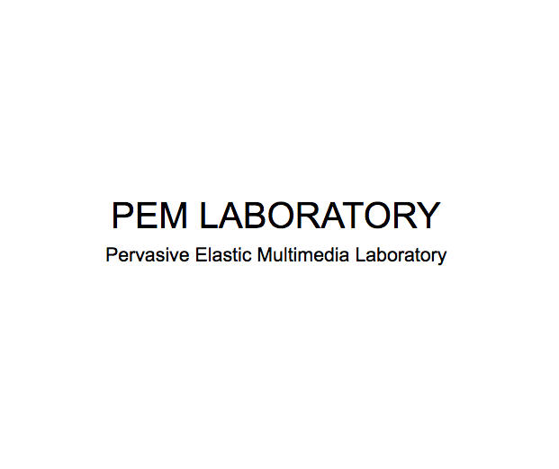

# About PEM Lab

## ABOUT US

Subject : Big Data, Distributed Computing, etc

Location : PEM Lab, 94, Wausan-ro, Mapo-gu, Seoul, Republic of Korea

Post Code : 04066

Tel : (+82)320-1105

## Member

### PROFESSOR
**Hayoon Song** ( hayoon@hongik.ac.kr )

### GRADUATE STUDENT
- Suchan Hong
- YM Kim
- SJ Kim

### UNDER GRADUATE STUDENT
- Minsuk Sung ( mssung94@gmail.com )
- Insoo Han
- Hyechang Han
- Geunju Lee
- Kyeonhwan Yang
- Dongwon Lee
- Jisun Yoon

## PROJECTS
- 
